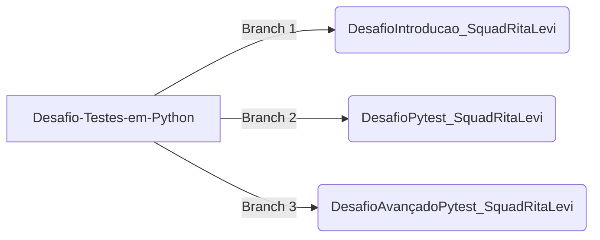

# Desafio #5 - Testes em Python

Olá, somos a squad Rita Levi Montalcini! Neste repositório disponibilizamos os códigos dos exercícios disponibilizados nos minicursos de testes em Python da Microsoft. Segue a lista de minicursos.
1. [Introdução a testes no Python - Unittest](https://learn.microsoft.com/pt-br/training/modules/python-get-started-testing/)
2. [Fazer testes com Pytest](https://learn.microsoft.com/pt-br/training/modules/test-python-with-pytest/)
3. [Teste Avançado com Pytest](https://learn.microsoft.com/pt-br/training/modules/python-advanced-pytest/)

## Como estruturamos o repositório
Criamos branches para cada exercício, como pode ser observado no fluxograma. A branch 1 corresponde ao exercício de [Introdução a testes no Python](https://learn.microsoft.com/pt-br/training/modules/python-get-started-testing/), enquanto as branches 2 e 3 correspodem aos exercícios de PyTest e PyTest Avançado.

## Requisitos para realizar a atividade
Para realizar a atividade utilizamos dois frameworks de teste em python, o **UnitTest** que é um módulo que já vem integrado ao python e o **PyTest** que tivemos que instalar  por meio do comando  `pip install pytest` no terminal.

## Como nos organizamos para este desafio

### Componentes da Squad :star2:

- [Beatriz Lima](https://github.com/beadlim)
- [Karen Ribeiro](https://github.com/karenribeiro7)
- [Melissa Gasque](https://github.com/MelissaGasque)
- [Natália Marin](https://github.com/NaHaze)
- [Yara Uchoa](https://github.com/YaraDanieleUchoa)
- [Flora Fentanes](https://github.com/Florafb)
- [Daniela Morsch](https://github.com/DaniMorsch)
- [Camilla Barros](https://github.com/cabarros3)

