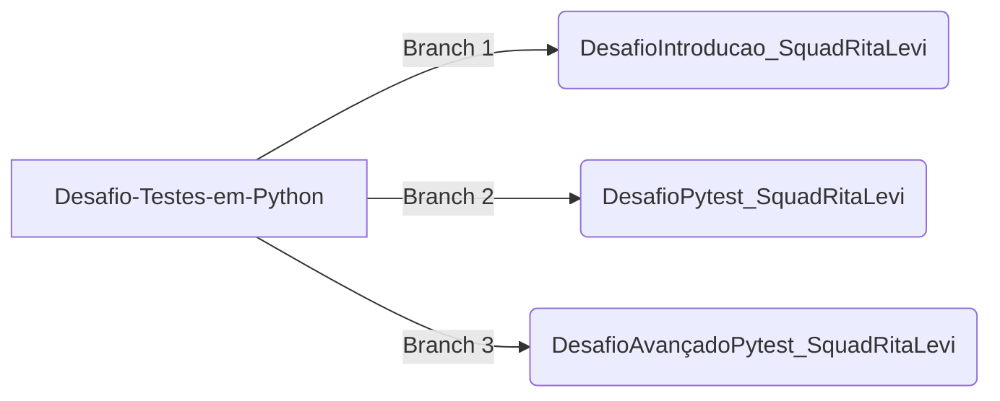

# Desafio #5 - Testes em Python

Olá, somos a squad Rita Levi Montalcini! Neste repositório disponibilizamos os códigos dos exercícios disponibilizados nos minicursos de testes em Python da Microsoft. Segue a lista de minicursos.
1. [Introdução a testes no Python - Unittest](https://learn.microsoft.com/pt-br/training/modules/python-get-started-testing/)
2. [Fazer testes com Pytest](https://learn.microsoft.com/pt-br/training/modules/test-python-with-pytest/)
3. [Teste Avançado com Pytest](https://learn.microsoft.com/pt-br/training/modules/python-advanced-pytest/)

## Como estruturamos o repositório
Criamos branches para cada exercício, como pode ser observado no fluxograma. A branch 1 corresponde ao exercício de [Introdução a testes no Python](https://learn.microsoft.com/pt-br/training/modules/python-get-started-testing/), enquanto as branches 2 e 3 correspodem aos exercícios de PyTest e PyTest Avançado.

## Requisitos para realizar a atividade
Para realizar a atividade utilizamos dois frameworks de teste em python, o **UnitTest** que é um módulo que já vem integrado ao python e o **PyTest** que tivemos que instalar  por meio do comando  `pip install pytest` no terminal.

## Como nos organizamos para este desafio
1. Fizemos um primeiro encontro para dividir as Task's de cada um.
2. Participação de quase todas as integrantes.
3. Fizemos outros encontros para estudar e desenvolver o desafio juntas.

## Resolução e lógica do exercício de Unittest
No exercício do minicurso 1 - Introdução a testes em python, seguindo os passos indicados pelo minicurso, a ideia/lógica é criar uma função que verifica se o valor (dado) de entrada pertence ao conjunto de valores verdadeiros ou falsos.

Neste exercício, o teste (Assert), foi realizado usando o unittest. Este framework possui uma classe chamada `TestCase` que possui vários métodos capazes de testar e reportar falhas no código. No caso do exercício, foi utilizado o método `.assertTrue()` que testa se a expressão é verdadeira ou não.

Outra grande parte dos teste é corrigir/prever as falhas. Neste exercício, foram utilizados:  `value = value.lower()` para deixar todos os caracteres minúsculos e evitar erro de digitação; try e except para invocar uma exceção que gera por meio do método `AtributeError()` um aviso de que um tipo diferente de caractere foi usado; para testar se o `AtributeError()` está funcionando corretamente foi preciso elaborar um teste usando o `assertRaises()`para verificar se uma exceção específica foi invocada.

### Componentes da Squad :star2:

- [Beatriz Lima](https://github.com/beadlim)
- [Karen Ribeiro](https://github.com/karenribeiro7)
- [Melissa Gasque](https://github.com/MelissaGasque)
- [Natália Marin](https://github.com/NaHaze)
- [Yara Uchoa](https://github.com/YaraDanieleUchoa)
- [Flora Fentanes](https://github.com/Florafb)
- [Daniela Morsch](https://github.com/DaniMorsch)
- [Camilla Barros](https://github.com/cabarros3)

